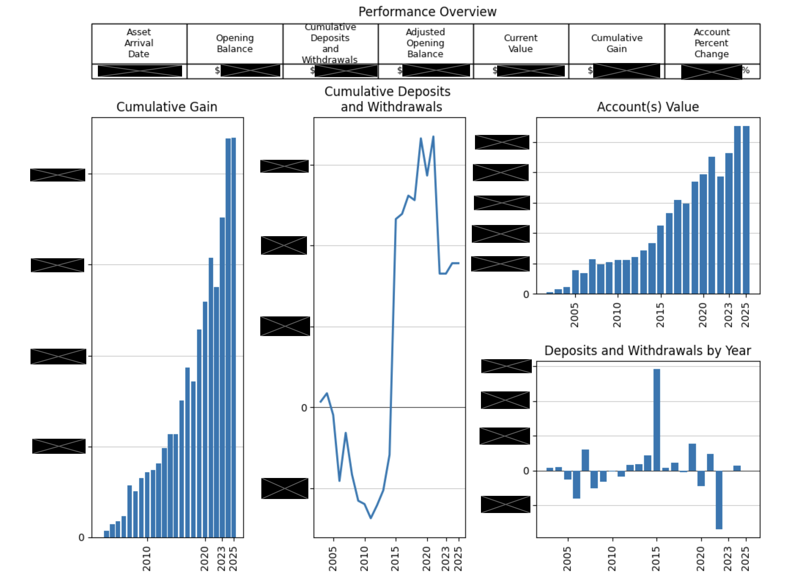

# Client Performance Chart

This script generates a **comprehensive performance overview** for client account groups over the full investment timeline.  
It is part of the **Stock_Automation** project and is built for this company’s data structure.  
**Note:** This tool is not a general-purpose financial app — it assumes specific column names and input formats.



> **Note**: Numerical values have been redacted due to data sensitivity.
---

## Features
- Interactive group ID entry (single or multiple).  
- Filters for **active accounts**.  
- Calculates and displays:
  - **Cumulative Gain / Loss** (vs. adjusted opening balance).  
  - **Cumulative Deposits and Withdrawals**.  
  - **Account Value** over time.  
  - **Yearly Deposits/Withdrawals**.  
- Generates a **summary table** with:
  - Asset arrival date  
  - Opening balance  
  - Cumulative deposits/withdrawals  
  - Adjusted opening balance  
  - Current value  
  - Cumulative gain  
  - Account percent change  
- Exports an optional **PDF performance overview**.

---

## Input Format
The Excel file should include the following fields:

- `groupld` – Group identifier (e.g. `000019`).  
- `Status` – Must contain `"Active"`.  
- Time-series columns such as:
  - `YYYYClosingBal`  
  - `YYYYAdjOpenBal`  
  - `YYYYNetDepWD`  
- `Current Value`  
- `assetArrivalDate`  
- `assetsAtArrival`  

Paths at the top of the script must be set:

```python
file_path = r"PATH_TO_FOLDER"
data_file = r"YOUR_FILE.xlsx"
save_loc  = r"PATH_TO_SAVE"


