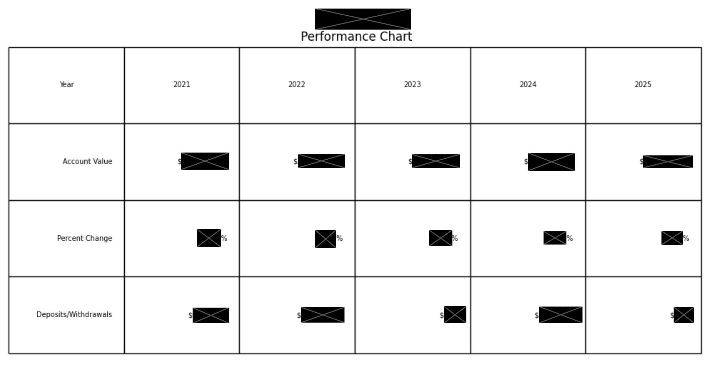

# Last Few Years – Performance Chart Generator

This project generates a **performance summary table** for customer groups over the last several years.  
It was designed for internal use with this company’s account data format.  
**Note:** This is not intended as a general-purpose financial tool — it relies on specific column names and structure in the source data for an individual company



> **Note**: Numerical values have been redacted due to data sensitivity.


---

## What It Does
- Reads customer account data from an Excel file.  
- Prompts for one or more **group IDs** (e.g. `10`).  
- Filters for **active accounts** in those groups.  
- Calculates:
  - **Account Value** for each year.  
  - **Percent Change** relative to adjusted opening balance.  
  - **Net Deposits/Withdrawals** for each year.  
- Outputs a **formatted chart** as both a Matplotlib figure and an optional saved PDF.

---

## Input Requirements
The Excel file should contain (at minimum) the following columns:

- `groupld` – Group identifier (e.g. `10`).  
- `Status` – Must include `"Active"`.  
- Yearly balances, e.g.:
  - `2022ClosingBal`, `2023ClosingBal`, ...  
  - `2022AdjOpenBal`, `2023AdjOpenBal`, ...  
  - `2022NetDepWD`, `2023NetDepWD`, ...  
- `Current Value` – Latest account value.

Paths for:
- `data_path` → folder containing your Excel file  
- `file_name` → the Excel file name  
- `save_loc` → folder to save generated PDFs  

must be set at the top of the script.

---

## How to Run
1. Update paths in `Last_Few_Years.py`:
   ```python
   data_path = r"PATH_TO_DATA"
   file_name = r"YOUR_FILE.xlsx"
   save_loc = r"PATH_TO_SAVE"
   ```

---

## License

This project is licensed under the [MIT License](../LICENSE).

---

## Disclaimer

This software is provided for informational and educational purposes only.  
It does not constitute financial advice or a recommendation to trade securities.


