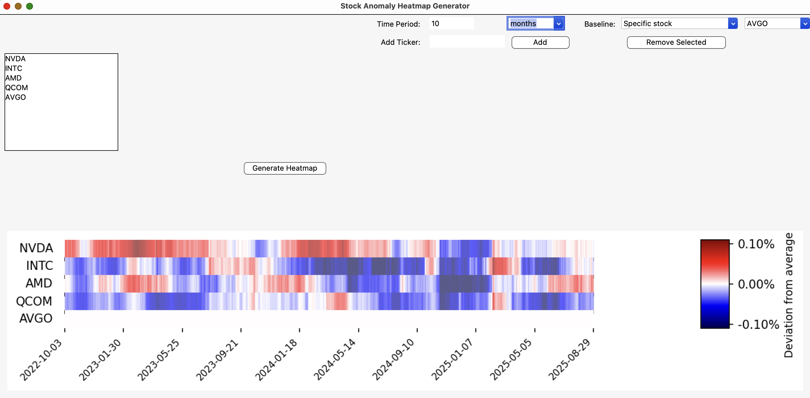

# Stock Anomaly Heatmap Generator

A desktop GUI (Tkinter) for spotting **ticker-specific deviations** from a chosen baseline over flexible time ranges.  
The app fetches prices from Yahoo Finance, computes smoothed percent-change series, and visualizes **deviations from the basket average or a selected baseline stock** as a time-aligned heatmap.



> **Note**: All configuration (tickers, time period, baseline) is done in the GUI—no command-line flags.

---

## Features

- **Point-and-click ticker list** (add/remove; `Delete` key removes selected).
- **Flexible time window**: X days / months / years.
- **Baseline options**:
  - *Default (basket mean)* – average of all selected tickers.
  - *Specific stock* – deviations relative to one chosen ticker.
- **Adaptive intraday handling** based on your time range:
  - ≤ 7 days → 1-minute data  
  - ≤ 60 days → 5-minute data  
  - ≤ ~2 years → 1-hour data  
  - Longer → daily data
- **Smoothing & signal highlighting**:
  - Gaussian smoothing on both baseline and tickers.
  - Centered moving average (≈10% of series length).
  - Red/blue overlays emphasize stronger positive/negative deviations.
- **Readable axis**: date-only x-labels (time-of-day removed).
- **No API keys** required.

---

## Installation

### Requirements
- Python 3.10+
- Works on macOS, Windows, Linux (Tkinter GUI).

### Install dependencies

Install required packages manually:

```bash
pip install yfinance pandas numpy scipy matplotlib requests
