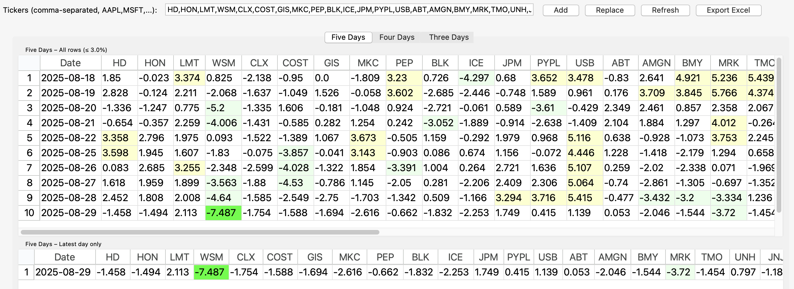

# Stock Drops (3/4/5-Day) — Tk GUI

A lightweight desktop app that flags notable short-term moves in your watchlist.  
It pulls daily prices from Yahoo Finance, computes 3-, 4-, and 5-day percent changes, and highlights big drops/rises in a compact heat-table. Export to Excel in one click.

> Works best with `tksheet` (per-cell coloring). If `tksheet` isn’t installed, it falls back to a standard `Treeview` with row-level coloring.

---

## Features

- **Point-and-click watchlist**
  - Add or replace tickers via the input box (`AAPL,MSFT,...`).
  - Sensible default list included (large caps, REITs, rails, etc.).
- **Three horizons (tabs)**
  - **Five Days**, **Four Days**, **Three Days**.
  - Each tab shows **All rows (last ~2 weeks)** and **Latest day only**.
- **Smart data fetch**
  - Uses Yahoo’s v8 **chart** API directly (single shared session; fewer quirks).
  - Quietly **falls back to `yfinance`** if needed.
  - Time zone normalized to market local time, index kept tz-naive for consistency.
- **Signal highlighting**
  - Defaults (editable in code):
    - Drops: soft ≤ **−3%**, strong ≤ **−6%**.
    - Rises: soft ≥ **+3%**, strong ≥ **+6%**.
  - With `tksheet`: per-cell colors (light/strong for down and up).
- **Excel export**
  - One workbook with sections for each horizon:
    - “<Horizon> Drops (≤3.0%)” (full window)  
    - “<Horizon> Latest” (latest trading day)
- **Snappy UI**
  - Background thread for fetch/compute; status bar updates.
  - Notebook layout; resizable; remembers column widths within the session.

---

## Screenshot

If you add the image to the repo root as `Stock_Drops_Output.png`, this will render on GitHub:



---

## How it works (math + data window)

- For each ticker, fetch recent **Daily** OHLCV (≈ last 10 business days, displayed window ≈ last **14 calendar days**).
- Compute percent changes:
  - 5-day: `100 * (Close[t] / Close[t-5] − 1)`
  - 4-day: `100 * (Close[t] / Close[t-4] − 1)`
  - 3-day: `100 * (Close[t] / Close[t-3] − 1)`
- Drop fully-NaN rows (the very top of each table often has incomplete lookback).
- Round to 3 decimals for display; latest trading day also shown as its own mini-table.

---

## Install

> Requires Python **3.9+** (tested on 3.11/3.12). `tkinter` comes with most Python builds on macOS/Windows. On Linux, you may need to install your distro’s `python3-tk`.

```bash
# (Recommended) Create and activate a virtual environment
python -m venv .venv
source .venv/bin/activate           # Windows: .venv\Scripts\activate

# Install deps
pip install -r requirements.txt
```


## Run

python stock_drops_app.py

Where `stock_drops_app.py` is whatever you name the script.

---

## Requirements

pandas
requests
yfinance
openpyxl
tksheet==6.2.10 ; python_version >= "3.9"   # optional but enables per-cell colors

> Notes  
> • `tksheet` is optional; without it, the app still runs using `Treeview`.  
> • You don’t install `tkinter` via `pip`. On Linux, install your OS package (`sudo apt-get install python3-tk`, etc.).  

---

## Usage tips

- **Add** vs **Replace**  
  - *Add* merges new tickers with the current list (ignoring duplicates).  
  - *Replace* overwrites the list with exactly what you typed.
- **Refresh**  
  - Refetches prices and recomputes tables in a background thread.
- **Export Excel**  
  - Creates a single sheet with labeled sections for each horizon and the latest-day view.
- **Customization** (edit the constants near the top of the file):
  - `DEFAULT_TICKERS` — your starter list.
  - `PCT_DROP_THRESHOLD_SOFT/STRONG` and `PCT_RISE_THRESHOLD_SOFT/STRONG`.
  - `HORIZONS` — e.g., add `(2, "Two Days")` if you want a 2-day tab.
- **Data source behavior**  
  - Primary: direct Yahoo chart API (v8).  
  - Fallback: `yfinance`.  
  - A shared `requests.Session` with browsery headers reduces rate-limit quirks.

---

## Troubleshooting

- **Blank tables**: network hiccup or all-NaN lookback (very recent IPO, halted, or ticker typo). Check the status bar and console messages.  
- **No per-cell coloring**: install `tksheet` (see requirements).  
- **Linux: missing tkinter**: install `python3-tk` (Ubuntu/Debian) or the equivalent for your distro.  
- **Corporate networks / proxies**: outbound calls to `query1.finance.yahoo.com` must be allowed.

---

## Privacy & limits

- No credentials or API keys are required.  
- Requests go directly to Yahoo Finance endpoints.  
- This tool is for **research/educational** use; data may be delayed or adjusted.

---

## License

MIT (or your preferred license).

---

## Changelog (you can update as you iterate)

- **v0.1.0** — Initial release: 3/4/5-day tabs, `tksheet` support, Excel export, Yahoo direct + `yfinance` fallback.

---

## Roadmap ideas

- User-settable thresholds and colors (GUI controls).  
- Multi-interval support (weekly/monthly percent changes).  
- CSV export and copy-to-clipboard.  
- Column sorting and quick filters.  

---

### Credits

Built with `tkinter`, `tksheet`, `pandas`, `requests`, `openpyxl`, and `yfinance` (fallback).

